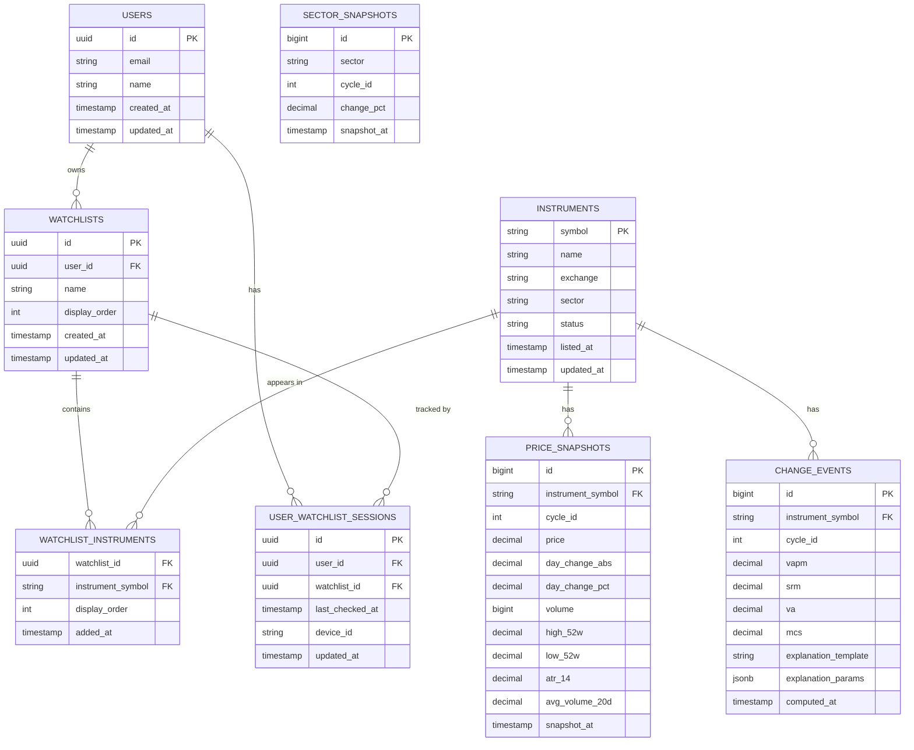
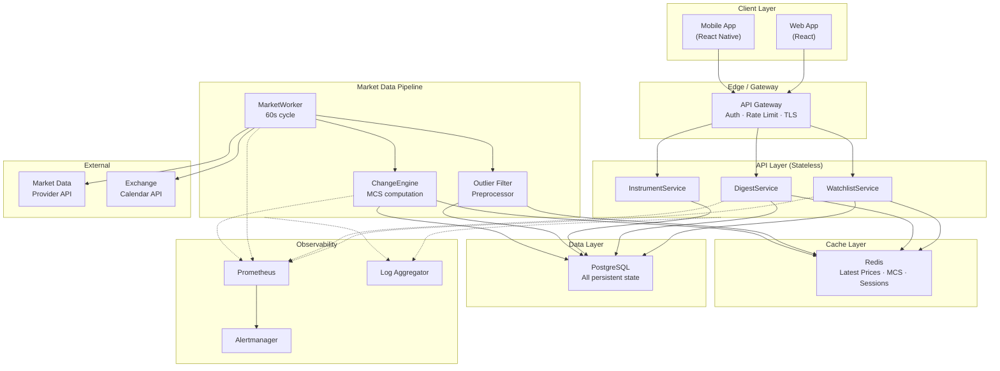
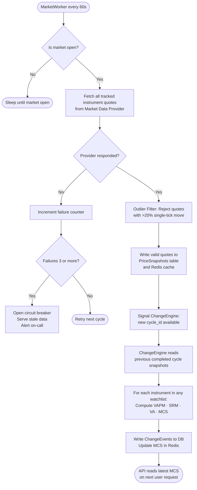
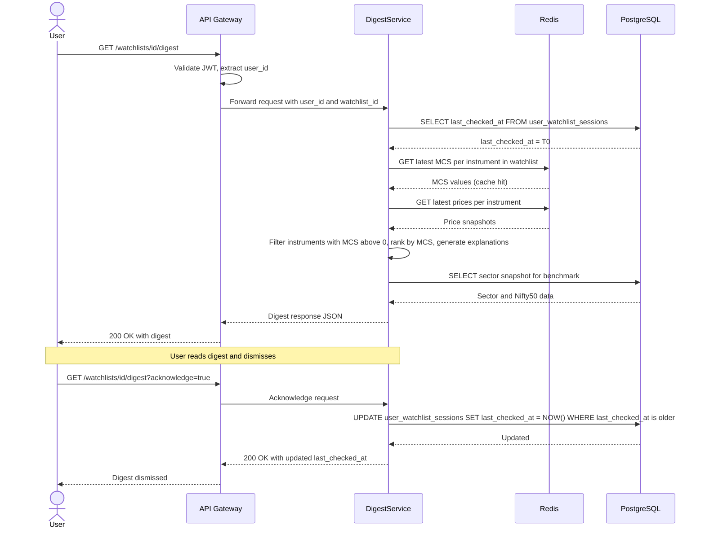
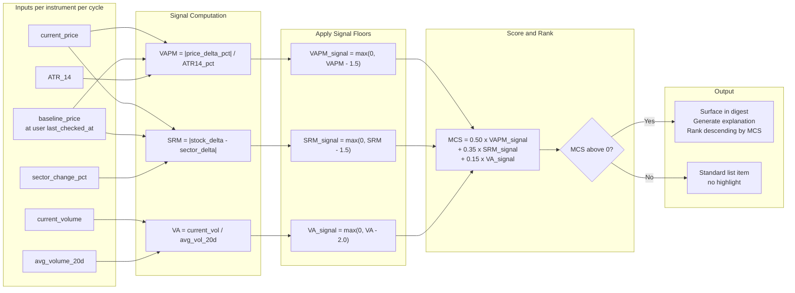
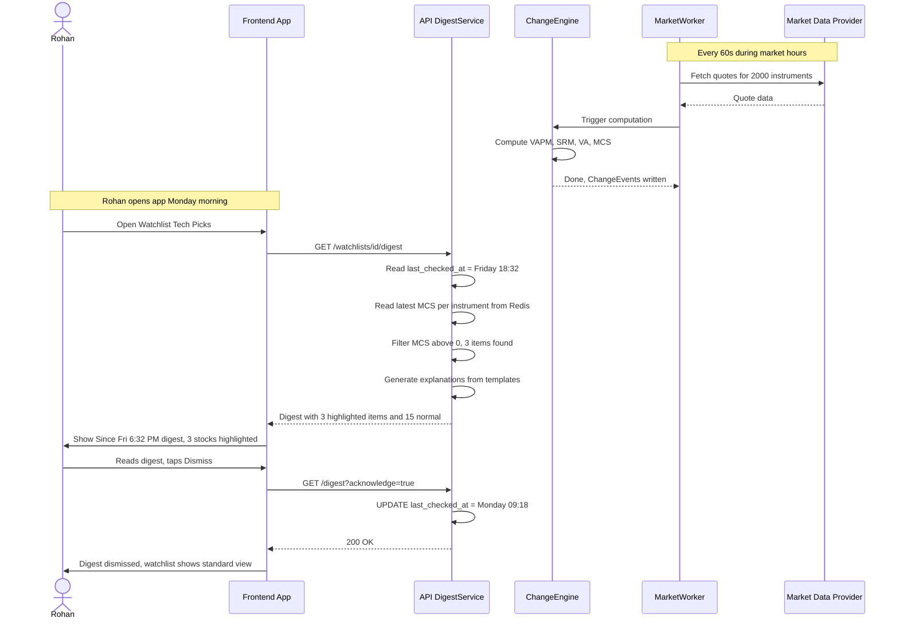

# GROWW CODE 2026 — Smart Market Watchlist
# Design Document

> **Document version:** 1.0  
> **Date:** 4 September 2026  
> **Team:** GROWW CODE 2026 Submission  
> **Status:** Final (pre-implementation)

---

## Table of Contents

1. [Executive Summary](#1-executive-summary)
2. [Problem Statement](#2-problem-statement)
3. [Problem Interpretation](#3-problem-interpretation)
4. [Target User](#4-target-user)
5. [User Personas](#5-user-personas)
6. [User Stories](#6-user-stories)
7. [Functional Requirements](#7-functional-requirements)
8. [Non-Functional Requirements](#8-non-functional-requirements)
9. [Product Principles](#9-product-principles)
10. [Core User Journey](#10-core-user-journey)
11. [Proposed Solution](#11-proposed-solution)
12. [Meaningful Change Definition](#12-meaningful-change-definition)
13. [Meaningful Change Scoring Model](#13-meaningful-change-scoring-model)
14. [Explanation Model](#14-explanation-model)
15. [Watchlist State Model](#15-watchlist-state-model)
16. ["Since Last Checked" Design](#16-since-last-checked-design)
17. [Market Context](#17-market-context)
18. [Data Freshness Model](#18-data-freshness-model)
19. [Failure Handling](#19-failure-handling)
20. [Edge Cases](#20-edge-cases)
21. [Concurrency Considerations](#21-concurrency-considerations)
22. [Security](#22-security)
23. [Observability](#23-observability)
24. [Scalability](#24-scalability)
25. [Database Design](#25-database-design)
26. [API Design](#26-api-design)
27. [High-Level Architecture (HLD)](#27-high-level-architecture-hld)
28. [Data Flow](#28-data-flow)
29. [Component Responsibilities](#29-component-responsibilities)
30. [Technology Choices](#30-technology-choices)
31. [Trade-offs](#31-trade-offs)
32. [What We Deliberately Do NOT Build](#32-what-we-deliberately-do-not-build)
33. [Future Evolution](#33-future-evolution)

---

## 1. Executive Summary

Most market watchlists answer the question: _"Where is each stock right now?"_

This product answers a different question: _"Since I last looked, what actually changed — and what deserves my attention?"_

The **Smart Market Watchlist** is a **change-first market intelligence layer** built on top of a standard watchlist. When a user returns after any period of absence, they are not greeted with a wall of tickers and prices. Instead, the system surfaces a curated, ranked digest of meaningful movements, each accompanied by a plain-language explanation of *why* it changed and *what context* makes it significant.

The system does not offer financial advice. It does not predict the future. It explains the past — clearly, honestly, and only when something is actually worth explaining.

**Core engineering bet:** A small, well-defined set of signals (price deviation from volatility-adjusted baseline, volume anomaly, sector relative performance) processed reliably with a clear scoring model produces more trust and utility than a large, opaque ML system that surfaces changes users cannot understand.

---

## 2. Problem Statement

Retail investors who maintain a watchlist face three compounding problems when they return to the market after any period of absence (overnight, a weekend, a vacation):

1. **Information overload.** Every ticker has moved. Everything looks like news. Nothing is clearly more important than anything else.
2. **Missing context.** A 3% price drop is very different if the entire sector fell 4%, or if the company just published earnings, or if the stock typically moves ±5% daily.
3. **No memory of intent.** The user added a stock to their watchlist weeks ago for a reason. The watchlist shows no memory of that context and no record of what has changed since they last engaged.

The result: users must either spend significant cognitive effort reconstructing context on each visit, or they stop maintaining the watchlist altogether because it does not earn its place in their routine.

---

## 3. Problem Interpretation

### What the brief is really asking

The brief describes minimum requirements (create watchlists, view market data, see what changed) but these are table stakes. The real challenge is:

> _Design a system that has genuine opinions about what matters — and can explain those opinions in plain language — without crossing the line into financial advice._

This requires:

- **A signal selection decision:** Which signals are genuinely informative vs. noise?
- **A scoring model:** How do you combine multiple weak signals into a single ranked list without creating a black box?
- **An explanation contract:** Every ranked item must be explainable. If you cannot explain why something surfaced, it should not surface.
- **A state design:** "Since last checked" is deceptively hard. What is the correct checkpoint? What happens when two devices are in use? What happens when markets are closed?
- **A data reliability design:** Market data is delayed, sometimes wrong, sometimes missing. The system must behave gracefully in all these cases.

### What we are NOT interpreting this as

- A trading platform or execution system.
- A recommendation engine that tells users what to buy or sell.
- A real-time alerting system (push notifications are out of scope for v1).
- A portfolio tracker (we do not know quantities or cost basis).

---

## 4. Target User

**Primary:** The informed retail investor in India who:
- Uses Groww (or similar platforms) to invest in equity mutual funds and/or direct stocks.
- Follows markets with genuine interest but limited time — checks the market once or twice a day.
- Has a watchlist of 10–30 stocks they are genuinely tracking or considering.
- Is not a day-trader. Does not need millisecond updates.
- Wants to *understand* market movements, not just observe them.

**Secondary:** The curious first-time investor who:
- Is learning how markets work.
- Needs help distinguishing noise from signal.
- Benefits from plain-language context more than from raw numbers.

---

## 5. User Personas

### Persona A — Rohan, the Weekend Investor (Primary)

| Attribute | Detail |
|---|---|
| Age | 31 |
| Occupation | Software engineer, Bengaluru |
| Investment experience | 4 years, self-directed |
| Watchlist size | 18 stocks |
| Check frequency | Once in the morning, once after market close |
| Key frustration | "I open my watchlist and have no idea where to start. Everything is red or green but I can't tell what actually happened." |
| Key need | A concise digest that tells him what changed and why, so he can decide in 2 minutes whether he needs to act. |
| Device | Mobile-first, occasionally web |

---

### Persona B — Priya, the Learning Investor (Secondary)

| Attribute | Detail |
|---|---|
| Age | 26 |
| Occupation | Product manager, Mumbai |
| Investment experience | 1 year, mutual funds + a few direct stocks |
| Watchlist size | 8 stocks |
| Check frequency | A few times a week |
| Key frustration | "I see a stock dropped 4% but I don't know if that's normal or alarming." |
| Key need | Plain-language explanations that give her the market context she's missing. |
| Device | Mobile only |

---

### Persona C — Vikram, the Active Researcher (Tertiary)

| Attribute | Detail |
|---|---|
| Age | 45 |
| Occupation | Finance professional, Delhi |
| Investment experience | 15 years |
| Watchlist size | 40+ stocks across sectors |
| Check frequency | Multiple times per day |
| Key frustration | "Watchlists are dumb lists. I need to see which stocks are behaving unusually — not just moving." |
| Key need | Volume anomaly detection and sector-relative performance. |
| Device | Web-primary |

---

## 6. User Stories

### Watchlist Management

| ID | Story | Priority |
|---|---|---|
| US-01 | As a user, I can create a named watchlist so I can organise stocks by theme (e.g. "Tech", "PSU Banks"). | P0 |
| US-02 | As a user, I can add stocks to a watchlist by searching by name or ticker symbol. | P0 |
| US-03 | As a user, I can remove stocks from a watchlist without losing my session state. | P0 |
| US-04 | As a user, I can have multiple watchlists. | P1 |
| US-05 | As a user, I can reorder stocks within a watchlist. | P2 |

### Market Information

| ID | Story | Priority |
|---|---|---|
| US-06 | As a user, I can see the current price, day change (INR and %), and volume for each stock in my watchlist. | P0 |
| US-07 | As a user, I can see the 52-week high/low for any stock. | P1 |
| US-08 | As a user, I can see the sector a stock belongs to and how that sector performed today. | P1 |

### Change Detection

| ID | Story | Priority |
|---|---|---|
| US-09 | As a user returning to the app, I immediately see a "Since You Last Checked" digest showing the most meaningful changes first. | P0 |
| US-10 | As a user, I can see a plain-language explanation for each highlighted change (e.g. "HDFC Bank fell 3.1% on high volume — sector fell 0.4%, making this move notable."). | P0 |
| US-11 | As a user, I can see how long ago I last viewed my watchlist, so I understand the time window of the digest. | P0 |
| US-12 | As a user, if nothing meaningful has changed since my last visit, I see a calm confirmation: "Nothing significant changed since you last checked." | P0 |
| US-13 | As a user, I can dismiss a change from the digest so it does not resurface until the next meaningful move. | P1 |

### Data Reliability

| ID | Story | Priority |
|---|---|---|
| US-14 | As a user, I can see a clear label when data is delayed (e.g. "15-min delayed") so I know not to make time-sensitive decisions based on it. | P0 |
| US-15 | As a user, I see a graceful error state if market data is unavailable, not a broken screen. | P0 |

---

## 7. Functional Requirements

### FR-1: Watchlist CRUD
- Users can create, read, update, and delete watchlists.
- Each watchlist has a name and an ordered list of instrument identifiers.
- A user may have at most **10 watchlists**, each containing at most **100 instruments** (to keep scope manageable and prevent abuse).

### FR-2: Instrument Search
- Users can search instruments by partial name or ticker symbol.
- Search results return: symbol, full name, exchange, sector.
- Search is scoped to NSE/BSE equities.

### FR-3: Market Data Display
- Per instrument: last traded price, day absolute change, day percentage change, day volume, 52w high, 52w low.
- Per watchlist header: timestamp of last data fetch, data freshness label.

### FR-4: Change Detection Engine
- The system computes a **Meaningful Change Score (MCS)** for each instrument in a user's watchlist between the user's `last_checked_at` timestamp and the current time.
- Instruments are ranked by MCS descending.
- Only instruments with MCS above zero are surfaced in the digest.

### FR-5: Explanation Generation
- Every item in the digest must carry a machine-generated plain-language explanation (max 2 sentences).
- Explanations reference the actual signal(s) that drove the score.
- Explanations are factual. They do not contain forward-looking statements.

### FR-6: Session State / "Since Last Checked"
- `last_checked_at` is recorded per (user, watchlist) pair.
- It is updated when the user explicitly dismisses the digest or after a configurable dwell time on the watchlist view.
- On multi-device, the most recent `last_checked_at` across all sessions is used (last-write-wins per device with server reconciliation — see Section 21).

### FR-7: Data Freshness Labelling
- Every data response includes a `data_as_of` timestamp.
- The frontend renders a freshness indicator: "Live", "15-min delayed", "Market closed — last updated HH:MM".

### FR-8: Graceful Degradation
- If market data is unavailable, the watchlist renders with the last known cached price and a "Data unavailable — showing cached prices from HH:MM" banner.
- Change detection is paused; the digest is not surfaced during a data outage.

---

## 8. Non-Functional Requirements

| Category | Requirement |
|---|---|
| **Availability** | 99.9% uptime for the API (excluding planned maintenance and market data provider outages). |
| **Latency** | p95 API response for watchlist + digest: < 400 ms. p99: < 800 ms. |
| **Throughput** | System must handle 10,000 concurrent active users during market open hours (9:15–15:30 IST). |
| **Data freshness** | Market data refreshed every **60 seconds** during market hours from upstream provider. |
| **Staleness tolerance** | Display data up to 5 minutes old. Beyond 5 minutes, surface a stale data warning. |
| **Security** | All APIs authenticated. User data isolated by `user_id`. No cross-user data leakage. |
| **Observability** | All API calls, change detection events, and data fetch cycles must emit structured logs and metrics. |
| **Scalability** | The market data pipeline must support up to **2,000 tracked instruments** without per-user fan-out cost. |
| **Maintainability** | The scoring model coefficients must be configurable via environment/config without a code deploy. |
| **Data retention** | Price snapshots retained for 30 days. User state (watchlists, `last_checked_at`) retained indefinitely. |

---

## 9. Product Principles

These principles govern every design decision in this document.

### P1 — Change is the product, not price
The raw price of a stock is context-free. The *change* in price, adjusted for the stock's own historical volatility and the behaviour of its sector, is meaningful. We surface change, not price, as the primary signal.

### P2 — Every surface must earn its presence
If something appears on the screen, it must be there for a clear reason the user can understand. We never surface a metric "because we have the data". We surface it because it answers a question the user would ask.

### P3 — Explain, don't opine
We tell users *what happened* and *what context makes it notable*. We never tell them *what to do*. The explanation engine is a narrator, not an advisor.

### P4 — Silence is a valid product state
If nothing meaningful changed, the system says so — confidently. "Nothing significant changed since you last checked" is a complete, useful answer. We do not manufacture urgency.

### P5 — Reliability is trust
A user who sees stale data without being told it is stale will make a decision based on false information. We label data freshness explicitly and consistently. We would rather show a clear "data unavailable" state than silently show stale data.

### P6 — Simple signals, honest explanations
We deliberately choose a small set of signals we can explain in plain English. We reject signals that are accurate but opaque. Complexity the user cannot understand is not a feature — it is a liability.

---

## 10. Core User Journey

### Journey: Rohan returns after a weekend

```
Friday evening — Rohan opens the app, briefly scans his watchlist, and closes it.
  System records last_checked_at = Friday 18:32 IST for this watchlist.

Monday morning — Rohan opens the app.
  System computes MCS for each stock in Rohan's watchlist
  using Friday's closing snapshot as baseline and Monday's pre-open / opening data.
  "Since You Last Checked (Fri 6:32 PM)" digest appears at the top.
  3 stocks have MCS > 0. They appear ranked.
  Each has a one-line explanation:
    e.g. "RELIANCE fell 2.8% — the Nifty 50 fell 0.9%, making this move notable relative to the broader market."
  15 other stocks had no meaningful movement. They appear below the fold in the standard list.
  Rohan reads the 3 highlighted stocks, dismisses the digest.
  System updates last_checked_at = Monday 09:18 IST.
```

---

## 11. Proposed Solution

### Architecture in one sentence
A **pull-based, change-first watchlist API** backed by a **market data ingestion worker** that snapshots prices on a 60-second cycle, a **Change Detection Engine** that computes the Meaningful Change Score per instrument on each cycle, and a **read-through cache** that makes watchlist + digest retrieval fast without per-user fan-out at query time.

### What makes this different from a standard watchlist

| Standard watchlist | This product |
|---|---|
| Shows current prices | Shows *change from your last visit* |
| Treats all moves equally | Ranks moves by a defensible signal model |
| Gives raw numbers | Gives plain-language context |
| Has no memory of your visit | Persists your last-checked state |
| Shows everything | Shows what deserves attention; confirms when nothing does |

### Chosen signal set (deliberately small)

We choose **three signals** that are independently explainable:

1. **Volatility-Adjusted Price Movement (VAPM)** — how much the stock moved relative to its own recent historical volatility.
2. **Sector-Relative Movement (SRM)** — how much the stock moved relative to its sector index.
3. **Volume Anomaly (VA)** — how much today's volume deviates from the 20-day average daily volume.

These three signals cover the most common sources of meaningful change for a retail investor without requiring access to data (earnings transcripts, news feeds, options flow) that is expensive, noisy, or unavailable.

---

## 12. Meaningful Change Definition

### What is NOT meaningful change

- A stock moved 0.3% on a day the entire market moved 0.4%. That is market-level noise.
- A stock moved 2% on a day it historically moves 2–3%. That is within normal range for that stock.
- Volume is at 95% of average. That is normal.

### What IS meaningful change

A change is meaningful when **at least one of the following is true:**

| Condition | Plain English |
|---|---|
| Price moved > 1.5x ATR(14) since last check | The stock moved more than 1.5x its average true range — unusually large for this stock. |
| Stock moved > 1.5 percentage points relative to its sector index | The stock diverged meaningfully from its sector peers. |
| Volume is > 2x the 20-day average daily volume | Unusually high participation — something caused elevated interest. |

These thresholds are configurable. They are not predictions. They are filters that distinguish "this probably happened for a reason" from "this is routine market oscillation."

### What "since last checked" means for the computation

- **Baseline snapshot:** The last market data snapshot recorded at or before `user.last_checked_at` for each instrument.
- **Current snapshot:** The latest available market data snapshot.
- **Delta:** Current minus Baseline, used for all signal computations.

If `last_checked_at` is before the previous market close, the baseline is the previous day's close snapshot. This avoids spurious signals from after-hours gaps that are already well-known.

---

## 13. Meaningful Change Scoring Model

### Signal definitions

#### Signal 1: Volatility-Adjusted Price Movement (VAPM)

```
VAPM = |price_delta_pct| / ATR14_pct

Where:
  price_delta_pct = (current_price - baseline_price) / baseline_price * 100
  ATR14_pct       = ATR(14) expressed as % of price (rolling 14-day Average True Range)
```

- VAPM = 1.0 means the stock moved exactly one ATR. Normal.
- VAPM = 2.5 means the stock moved 2.5x its typical daily range. Notable.
- VAPM >= 1.5 contributes to the score.

#### Signal 2: Sector-Relative Movement (SRM)

```
SRM = |stock_delta_pct - sector_delta_pct|

Where:
  stock_delta_pct  = % change in stock price since baseline
  sector_delta_pct = % change in sector index since baseline
```

- SRM = 0 means stock moved exactly with its sector. No relative divergence.
- SRM = 3.0 means stock moved 3 percentage points more/less than sector. Notable.
- SRM >= 1.5 contributes to the score.

#### Signal 3: Volume Anomaly (VA)

```
VA = current_volume / avg_daily_volume_20d

Where:
  avg_daily_volume_20d = 20-day rolling average of daily traded volume
```

- VA = 1.0 means normal volume.
- VA = 2.5 means 2.5x average — elevated participation.
- VA >= 2.0 contributes to the score.

---

### Meaningful Change Score (MCS)

```
MCS = w1 * VAPM_signal + w2 * SRM_signal + w3 * VA_signal

Where:
  VAPM_signal = max(0, VAPM - 1.5)   // only contributions above threshold
  SRM_signal  = max(0, SRM - 1.5)    // only contributions above threshold
  VA_signal   = max(0, VA - 2.0)     // only contributions above threshold

Default weights:
  w1 = 0.50  (price movement is primary)
  w2 = 0.35  (sector context is important)
  w3 = 0.15  (volume is supporting evidence)
```

**Surfacing threshold:** `MCS > 0.0` (i.e., at least one signal exceeded its floor).

**Ranking:** Descending MCS. Ties broken by absolute price change (larger absolute change ranks higher).

### Why this model

| Property | Justification |
|---|---|
| **Explainable** | Each term maps directly to a signal the user can understand. |
| **Configurable** | Weights and thresholds are in config, not code. |
| **Additive** | Multiple weak signals combine to elevate a score, as they should. |
| **Bounded** | No signal contributes unboundedly — the `max(0, ...)` floor prevents negative scores. |
| **No ML** | No training data, no model drift, no black-box outputs. Appropriate for a 72-hour hackathon and defensible long-term. |

### Scoring example

| Stock | VAPM | SRM | VA | VAPM_signal | SRM_signal | VA_signal | MCS | Surfaces? |
|---|---|---|---|---|---|---|---|---|
| HDFC Bank | 2.8 | 3.2 | 1.1 | 1.30 | 1.70 | 0.00 | **1.25** | Yes |
| Infosys | 1.3 | 0.4 | 1.4 | 0.00 | 0.00 | 0.00 | **0.00** | No |
| Zomato | 1.6 | 0.8 | 3.1 | 0.05 | 0.00 | 1.10 | **0.19** | Yes (low rank) |

---

## 14. Explanation Model

### Design principle
Every surfaced item carries a template-driven, signal-aware explanation. Templates are deterministic — not LLM-generated — because:
- They can be audited.
- They cannot hallucinate.
- They are instantaneous (no API call latency).
- They meet Groww's transparency principle.

### Template library

Each explanation has two parts: a **lead** (what happened) and a **context** (why it's notable).

#### VAPM-primary templates

| Condition | Template |
|---|---|
| Stock rose, VAPM high | `{name} rose {delta_pct}% — larger than its typical daily move of +/-{atr_pct}%.` |
| Stock fell, VAPM high | `{name} fell {delta_pct}% — larger than its typical daily move of +/-{atr_pct}%.` |

#### SRM-primary templates

| Condition | Template |
|---|---|
| Stock outperformed sector significantly | `{name} rose {delta_pct}% while {sector} moved {sector_pct}% — a {srm}pp divergence.` |
| Stock underperformed sector significantly | `{name} fell {delta_pct}% while {sector} moved {sector_pct}% — a {srm}pp divergence.` |

#### VA-primary templates

| Condition | Template |
|---|---|
| Volume spike with price rise | `{name} rose {delta_pct}% on volume {va_x}x higher than its 20-day average.` |
| Volume spike with price fall | `{name} fell {delta_pct}% on volume {va_x}x higher than its 20-day average.` |
| Volume spike, price flat | `{name} saw {va_x}x its typical volume with little price change — unusual for this stock.` |

#### Combined signal template (when two or more signals fire)

`{name} {rose/fell} {delta_pct}% on {va_x}x typical volume — sector {sector} moved only {sector_pct}%.`

### Rules for explanation generation

1. Use the highest-scoring signal as the lead.
2. If a second signal also exceeds its floor, append it as context.
3. Never append more than two signals in one explanation (cognitive overload).
4. Never include forward-looking language ("may", "could", "expected to").
5. Never include investment-related language ("buy", "sell", "opportunity", "risk").

---

## 15. Watchlist State Model

### Core entities

| Entity | Description |
|---|---|
| `User` | Authenticated user account |
| `Watchlist` | Named list owned by a user |
| `WatchlistInstrument` | An instrument within a watchlist, with a display order |
| `Instrument` | A tradable security (symbol, name, sector, exchange) |
| `UserWatchlistSession` | Per-(user, watchlist) last-checked-at state |
| `PriceSnapshot` | Market data snapshot per instrument per cycle |
| `ChangeEvent` | Computed MCS for an instrument at a given snapshot |

### State machine: `last_checked_at`

```
States: NEVER_CHECKED, CHECKED, DISMISSED

NEVER_CHECKED
  On user opens watchlist for first time → CHECKED
    last_checked_at = NOW - market_open_time (or last close if pre-market)

CHECKED
  On user reads digest and explicitly dismisses → DISMISSED
    last_checked_at = NOW
  On user dwells on watchlist for > 30 seconds without dismissing → CHECKED
    last_checked_at = NOW - 30s (dwell timer update)

DISMISSED
  On user opens watchlist next time → CHECKED
    baseline_snapshot = snapshot closest to prev last_checked_at
```

### Dwell-time update rationale

We do not update `last_checked_at` instantaneously on page open. The user needs time to actually read the digest. We update it after **30 seconds of dwell time**, or on explicit dismiss. This prevents a fast tab-open-and-close from advancing the checkpoint without the user having actually read anything.

---

## 16. "Since Last Checked" Design

### The checkpoint problem

The key engineering challenge: `last_checked_at` must map to a specific **price snapshot** as the baseline for change computation. Raw timestamps do not map cleanly to market data because:

- Markets have open and close boundaries.
- Snapshots are taken every 60 seconds — there is no snapshot for every possible timestamp.
- A user who checked at 14:47:23 must be anchored to the 14:47:00 snapshot.

### Snapshot anchor logic

```sql
baseline_snapshot = latest PriceSnapshot WHERE
  snapshot_at <= user.last_checked_at
  AND instrument_id = X
```

If no snapshot exists at or before `last_checked_at` (e.g., user first visit ever), fall back to: yesterday's closing snapshot.

### Cross-session (multi-device) behaviour

| Scenario | Behaviour |
|---|---|
| User opens on mobile, then web | Server holds authoritative `last_checked_at`. Both devices read from server. |
| User dismisses digest on mobile | `last_checked_at` updated on server. Web session picks up new value on next load. |
| Two devices open simultaneously | Each reads the same `last_checked_at`. First dismiss wins. Server is authoritative. |
| Offline device dismisses | Dismissal synced on next online event. Conflict: server timestamp wins. |

### Market-hours boundary handling

| Scenario | Baseline used |
|---|---|
| User checked during market hours Friday, returning Monday pre-open | Friday's closing snapshot (15:30 IST) |
| User checked post-close Friday, returning Monday morning | Friday's closing snapshot |
| User checked Monday 10:00, returning Monday 11:00 | Monday 10:00 snapshot |
| User checked Monday, market closed early (holiday) | Last available snapshot before close |

### "Nothing changed" state

If all instruments in the watchlist have `MCS = 0`, the digest is suppressed and replaced with:

> _"Nothing significant has changed in your watchlist since Friday, 6:32 PM."_

This is a **complete and useful product state**, not a failure state.

---

## 17. Market Context

### Sector index context

For every instrument, we track the **sector index return** over the same window as the user's "since last checked" period. This is used in SRM computation and in explanations.

Sector indices tracked (NSE):
- Nifty Bank
- Nifty IT
- Nifty FMCG
- Nifty Auto
- Nifty Pharma
- Nifty Metal
- Nifty Realty
- Nifty Energy
- Nifty Financial Services
- Nifty Media
- Nifty Consumer Durables
- Nifty 50 (used as catch-all for stocks not in a specific sector index)

### Benchmark context

The Nifty 50 return over the same window is attached to every watchlist digest response. The frontend may display: "Nifty 50: +0.4% since you last checked."

This gives users a reference point for interpreting individual stock moves without requiring them to open a separate app.

### What we deliberately do NOT include as context

| Omitted | Reason |
|---|---|
| News headlines | Requires a news API integration; introduces editorial bias and hallucination risk |
| Earnings calendar | Complex to maintain accurately; can anchor users to the wrong expectation |
| Analyst ratings | Financial advice territory; against product principles |
| Insider trades | SEBI data is delayed and complex to parse correctly |
| Options activity | Out of scope for retail watchlist; would confuse target persona |

---

## 18. Data Freshness Model

### Data pipeline cycle

```
Every 60 seconds during market hours (09:15-15:30 IST, Mon-Fri, non-holiday):
  1. MarketWorker fetches quotes for all tracked instruments from upstream provider.
  2. Each quote is written to PriceSnapshot with snapshot_at = fetch_start_time.
  3. ChangeEngine reads the new snapshots and computes/updates ChangeEvents.
  4. Read cache (Redis) is updated with the latest PriceSnapshot per instrument.

Outside market hours:
  1. Pipeline is paused.
  2. Last snapshot of the day remains in cache.
  3. Staleness label: "Market closed — last updated HH:MM IST".
```

### Freshness labels

| Condition | Label displayed |
|---|---|
| Snapshot age < 90 seconds | "Live" |
| Snapshot age 90s to 5 minutes | "~{N} min delayed" |
| Snapshot age > 5 minutes, market open | "Data delayed — last updated HH:MM" |
| Market closed | "Market closed — last updated HH:MM IST" |
| Data source unavailable | "Data unavailable — showing cached prices from HH:MM" |

### Upstream provider failure

If the market data provider fails:
- The last successful snapshot remains in cache.
- All API responses include `data_freshness: "stale"` and `data_as_of: <last_snapshot_at>`.
- Change detection is paused (no new ChangeEvents computed from stale data).
- A monitoring alert fires within 5 minutes of pipeline failure.

---

## 19. Failure Handling

### Failure taxonomy

| Failure | Impact | Mitigation |
|---|---|---|
| Market data provider API down | No fresh data | Serve cached data with stale label; alert on-call |
| Market data returns partial data (some symbols missing) | Some instruments show stale prices | Missing symbols are flagged individually; rest of list renders normally |
| Market data returns corrupt/outlier price | Spurious MCS spike | Outlier filter: reject quotes where single-tick move > 20% (configurable per instrument type) |
| Database write failure (PriceSnapshot) | Data loss | Worker retries with exponential backoff (3 attempts); alert if all fail |
| ChangeEngine crash | No MCS updates | Last computed MCS served; digest shows data_as_of timestamp |
| API server crash | Users see errors | Load balancer health check; auto-restart; circuit breaker on downstream calls |
| User session `last_checked_at` write failure | Checkpoint not updated | Retry in background; fall back to client-side timestamp if server write unavailable |
| Redis cache miss | Slower response (DB fallback) | Always fall through to PostgreSQL; Redis is a performance layer, not critical path |

### Circuit breaker pattern

The MarketWorker wraps its upstream provider call in a circuit breaker:
- **Closed:** Normal operation.
- **Open:** After 3 consecutive failures within 60 seconds, skip the fetch cycle and serve stale data.
- **Half-open:** After 30 seconds, attempt one probe request. If successful, return to Closed.

---

## 20. Edge Cases

### Instrument-level

| Edge Case | Handling |
|---|---|
| Stock is circuit-breaker-halted (no trades) | Volume = 0; price unchanged. VA signal = 0. VAPM signal = 0. MCS = 0. No surfacing. |
| Stock is suspended / delisted | Mark as `status = SUSPENDED` in Instrument table. Show "Trading suspended" label. Remove from change detection. |
| Stock has a corporate action (split, bonus) on a day user was away | Price adjustment is applied to baseline snapshot before computing delta. ATR series is also adjusted. |
| Stock was added to watchlist after `last_checked_at` | No baseline snapshot exists before the add event. First digest skips this instrument with a note: "Added since your last visit." |
| ATR is unavailable (new listing, < 14 days of data) | VAPM signal disabled for this instrument; SRM and VA signals still computed. |

### User-level

| Edge Case | Handling |
|---|---|
| User has never checked their watchlist before | Treat baseline as "market open today". Surface what changed since market open. |
| User has not checked in > 30 days | Cap the baseline at 30 days ago (data retention limit). Surface a notice: "Showing changes over the past 30 days." |
| User checks multiple times within the same minute | `last_checked_at` resolution is 1 minute. Duplicate opens within 1 minute are idempotent. |
| User empties watchlist | Digest is empty. Show "Add stocks to your watchlist to see what's changed." |
| User with watchlist spanning multiple sessions (mobile + web) | Described in Section 16. Server-authoritative `last_checked_at`. |

### Market-level

| Edge Case | Handling |
|---|---|
| Market holiday (no trading) | Pipeline paused. Digest shows last close snapshot. "Market closed" label. |
| Early market close | Pipeline stops at actual close time. Detected via exchange calendar API (or static config). |
| Index rebalancing affects sector index | Sector index adjustments are transparent to the user; underlying computation is updated. |
| Extreme market event (circuit breaker at index level) | All instruments likely to have high VAPM. User sees many items in digest. This is correct behaviour — the digest should surface this. No artificial cap on digest size for such events. |

---

## 21. Concurrency Considerations

### Last-checked-at write contention (multi-device)

**Problem:** User opens watchlist on mobile and web simultaneously. Both read `last_checked_at = T0`. Both could attempt to update it to different values.

**Solution: Optimistic update with last-write-wins, server-side.**

```sql
UPDATE user_watchlist_sessions
SET last_checked_at = $new_time
WHERE user_id = $uid AND watchlist_id = $wid
  AND last_checked_at < $new_time   -- only advance, never rewind
```

The `AND last_checked_at < $new_time` guard ensures:
- The checkpoint only ever advances.
- A slower device that writes a stale timestamp cannot rewind the checkpoint.
- No distributed lock is needed.

### PriceSnapshot write concurrency

**Problem:** MarketWorker runs on 60-second cycles. A slow previous cycle could still be writing when the next cycle begins.

**Solution:** Each cycle is identified by a `cycle_id` (monotonic integer). Writes use `INSERT ... ON CONFLICT (instrument_id, cycle_id) DO NOTHING`. A slow cycle completing late writes its data safely without corrupting the faster cycle's data.

### ChangeEngine read/write ordering

**Problem:** ChangeEngine reads PriceSnapshot and writes ChangeEvents. If read happens mid-write, it may compute on partial data.

**Solution:** ChangeEngine reads snapshots with `cycle_id = MAX(cycle_id) - 1` — i.e., it always reads the *previous completed cycle*, not the currently-writing one. This provides a consistent read window at the cost of one cycle of latency (~60 seconds). Acceptable for this product.

---

## 22. Security

### Authentication
- All API endpoints require a valid JWT (issued at login).
- JWTs carry `user_id`, `session_id`, and expiry.
- JWTs are validated on every request; no per-request DB lookup (stateless validation).
- Refresh token rotation: refresh tokens are single-use and invalidated on use.

### Authorization
- All watchlist, session, and digest data is scoped to `user_id`.
- API layer enforces: `WHERE user_id = jwt.user_id` on all queries. Never trust client-supplied user IDs.
- No admin API endpoints are exposed publicly; admin tooling is on a separate internal network only.

### Data isolation
- PostgreSQL row-level security (RLS) enabled as defence-in-depth on watchlist tables.
- Redis keys namespaced by `user:{user_id}:*` to prevent accidental cross-user reads.

### Market data security
- Upstream API key stored in environment secrets manager (not in code or config files).
- Rate limiting on the MarketWorker to avoid triggering upstream provider's abuse controls.
- No user PII sent to upstream market data provider (only instrument identifiers).

### Input validation
- All instrument search queries are sanitized before SQL execution (parameterized queries only).
- Watchlist name max length: 64 characters. Enforced at API and DB level.
- Instrument symbol max length: 20 characters.

### Rate limiting
- Public-facing API: 100 requests/minute per user (token bucket).
- Search endpoint: 20 requests/minute per user (more expensive).

---

## 23. Observability

### Metrics (emitted to Prometheus / compatible sink)

| Metric | Type | Labels |
|---|---|---|
| `api_request_duration_seconds` | Histogram | endpoint, method, status_code |
| `market_worker_cycle_duration_seconds` | Histogram | — |
| `market_worker_instruments_fetched_total` | Counter | — |
| `market_worker_fetch_failures_total` | Counter | provider, error_type |
| `change_engine_events_computed_total` | Counter | — |
| `price_snapshot_age_seconds` | Gauge | — (current freshness) |
| `watchlist_digest_items_total` | Histogram | — (items per digest surfaced) |
| `cache_hit_ratio` | Gauge | cache_type (redis / pg) |

### Structured logs (JSON, to stdout → log aggregator)

Every log line includes: `timestamp`, `trace_id`, `user_id` (where applicable), `level`, `message`, `duration_ms`.

Key log events:
- Market worker cycle start/complete/failure.
- ChangeEngine computation start/complete.
- User opens watchlist (with `time_since_last_check` for funnel analysis).
- Digest surfaced (with `item_count`, `top_mcs`).
- Data freshness warning triggered.

### Alerts

| Alert | Condition | Severity |
|---|---|---|
| Market worker failed | 2+ consecutive cycle failures | P1 |
| Price data stale | `price_snapshot_age_seconds > 300` during market hours | P1 |
| API p99 latency high | p99 > 1.5s over 5-minute window | P2 |
| Change engine lag | ChangeEngine not updated in > 5 minutes during market hours | P1 |
| Error rate high | API 5xx rate > 1% over 1-minute window | P2 |

### Tracing
- Distributed tracing (OpenTelemetry) on all API requests.
- Trace ID propagated from API → WatchlistService → ChangeService → DB.
- Trace ID included in all error responses for supportability.

---

## 24. Scalability

### Market data pipeline scalability

The pipeline fetches data for all **tracked instruments** (all instruments on any user's watchlist), not per user. This is the key architectural decision that prevents per-user fan-out.

```
Tracked instruments = UNION of all instruments across all watchlists
= potentially 2,000 instruments

Market worker fetches 2,000 quotes per 60-second cycle.
This is one API call (or one batch call) regardless of how many users exist.
```

Cost does not scale with user count. It scales with **unique instrument count**, which is bounded by the size of the market (~1,600 NSE-listed equities).

### API scalability

- API servers are stateless. Horizontal scaling via adding replicas behind a load balancer.
- Database connections pooled via PgBouncer.
- Redis used as read-through cache for hot paths (current price, watchlist, latest MCS).

### Database scalability

- `price_snapshots` table is the highest-write table: 2,000 instruments × 1 write per 60 seconds = ~33 writes/second. Well within PostgreSQL's single-node capacity.
- `price_snapshots` partitioned by date (range partitioning). Old partitions can be dropped/archived after 30 days.
- `change_events` similarly partitioned.

### User scalability at 10,000 concurrent users

- Each user request hits the API, which reads from Redis (cache hit) → sub-millisecond.
- Cache miss falls through to PostgreSQL → still fast (indexed read by user_id + watchlist_id).
- The bottleneck at 10,000 concurrent users is the API layer and DB connection pool, not the market data pipeline.

### Scaling beyond 10,000 users

When user count exceeds what a single API node handles:
- Additional API replicas added. Stateless design supports this without coordination.
- PgBouncer pool size tuned.
- Redis cluster mode if cache memory exceeds single-node capacity.
- Market data pipeline remains unaffected (single-node, bounded by instrument count).

---

## 25. Database Design

### Entity Relationship Diagram



### Key indexes

```sql
-- Fast watchlist retrieval for a user
CREATE INDEX idx_watchlists_user_id ON watchlists(user_id);

-- Fast instrument lookup within a watchlist
CREATE INDEX idx_watchlist_instruments_watchlist_id ON watchlist_instruments(watchlist_id);

-- Fast latest price snapshot per instrument
CREATE INDEX idx_price_snapshots_symbol_cycle ON price_snapshots(instrument_symbol, cycle_id DESC);

-- Fast latest change event per instrument
CREATE INDEX idx_change_events_symbol_cycle ON change_events(instrument_symbol, cycle_id DESC);

-- Fast session lookup
CREATE UNIQUE INDEX idx_sessions_user_watchlist ON user_watchlist_sessions(user_id, watchlist_id);
```

### Partitioning

`price_snapshots` and `change_events` are partitioned by `snapshot_at` / `computed_at` using PostgreSQL declarative range partitioning (monthly partitions). Partitions older than 30 days are detached and archived.

---

## 26. API Design

### Base URL
```
https://api.groww-watchlist.example.com/v1
```

### Authentication
All endpoints require `Authorization: Bearer <jwt>` header.

---

### Watchlist APIs

#### `GET /watchlists`
Returns all watchlists for the authenticated user.

**Response:**
```json
{
  "watchlists": [
    {
      "id": "wl_abc123",
      "name": "Tech Picks",
      "instrument_count": 8,
      "created_at": "2026-08-01T10:00:00Z",
      "updated_at": "2026-09-03T14:22:00Z"
    }
  ]
}
```

---

#### `POST /watchlists`
Create a new watchlist.

**Request:**
```json
{ "name": "Tech Picks" }
```

**Response:** `201 Created` with the created watchlist object.

---

#### `DELETE /watchlists/{watchlist_id}`
Delete a watchlist and all associated state.

---

#### `GET /watchlists/{watchlist_id}`
Get a watchlist's instruments with current market data.

**Response:**
```json
{
  "watchlist": {
    "id": "wl_abc123",
    "name": "Tech Picks",
    "data_freshness": "live",
    "data_as_of": "2026-09-04T08:45:00Z",
    "instruments": [
      {
        "symbol": "INFY",
        "name": "Infosys Ltd",
        "sector": "IT",
        "price": 1874.25,
        "day_change_abs": -12.50,
        "day_change_pct": -0.66,
        "volume": 2340000,
        "high_52w": 2012.00,
        "low_52w": 1412.10,
        "data_status": "live"
      }
    ]
  }
}
```

---

#### `POST /watchlists/{watchlist_id}/instruments`
Add an instrument to the watchlist.

**Request:**
```json
{ "symbol": "RELIANCE" }
```

---

#### `DELETE /watchlists/{watchlist_id}/instruments/{symbol}`
Remove an instrument from the watchlist.

---

#### `PATCH /watchlists/{watchlist_id}/instruments/order`
Reorder instruments.

**Request:**
```json
{ "symbols": ["RELIANCE", "TCS", "INFY"] }
```

---

### Digest API

#### `GET /watchlists/{watchlist_id}/digest`
Returns the "since last checked" digest for a watchlist.

**Query params:**
- `acknowledge=true` — marks `last_checked_at` as now (explicit dismiss).

**Response:**
```json
{
  "digest": {
    "watchlist_id": "wl_abc123",
    "last_checked_at": "2026-09-01T18:32:00Z",
    "digest_window_label": "Since Friday, 6:32 PM",
    "benchmark": {
      "symbol": "NIFTY50",
      "change_pct": 0.42,
      "label": "Nifty 50 +0.42%"
    },
    "items": [
      {
        "symbol": "HDFCBANK",
        "name": "HDFC Bank Ltd",
        "sector": "Bank",
        "price": 1621.40,
        "delta_pct": -3.1,
        "mcs": 1.25,
        "signals": {
          "vapm": 2.8,
          "srm": 3.2,
          "va": 1.1
        },
        "explanation": "HDFC Bank fell 3.1% — sector Nifty Bank moved -0.4%, making this move notable."
      }
    ],
    "no_change_items_count": 5,
    "data_freshness": "live",
    "data_as_of": "2026-09-04T09:12:00Z"
  }
}
```

**`acknowledge=true` behaviour:** Updates `last_checked_at` on the server. Returns `200` with updated `last_checked_at`.

---

### Instrument Search API

#### `GET /instruments/search?q={query}&limit={N}`
Search for instruments.

**Response:**
```json
{
  "results": [
    {
      "symbol": "HDFCBANK",
      "name": "HDFC Bank Ltd",
      "exchange": "NSE",
      "sector": "Bank"
    }
  ]
}
```

---

### Error format

All errors follow RFC 7807 (Problem Details):
```json
{
  "type": "https://errors.groww-watchlist.example.com/watchlist-not-found",
  "title": "Watchlist not found",
  "status": 404,
  "detail": "Watchlist wl_xyz does not exist or does not belong to you.",
  "trace_id": "3e8c2b1a"
}
```

---

## 27. High-Level Architecture (HLD)



---

## 28. Data Flow

### Market Data Processing Flow



---

### Request Flow



---

### Meaningful Change Detection Flow



---

### User Journey Sequence Diagram



---

## 29. Component Responsibilities

| Component | Responsibility | Does NOT do |
|---|---|---|
| **API Gateway** | TLS termination, JWT validation, rate limiting, request routing | Business logic, data storage |
| **WatchlistService** | CRUD for watchlists and instruments; returns market data per watchlist | Change detection, explanation generation |
| **DigestService** | Reads MCS + prices from cache; builds ranked digest; generates explanations; manages `last_checked_at` | Market data fetching, signal computation |
| **InstrumentService** | Instrument search; returns instrument metadata | Market data, watchlist management |
| **MarketWorker** | Fetches quotes from upstream on 60s cycle; applies outlier filter; writes to DB and cache; signals ChangeEngine | API serving, user-level logic |
| **ChangeEngine** | Reads completed price cycle; computes VAPM, SRM, VA, MCS per instrument; writes ChangeEvents; updates Redis | Market data fetching, API serving |
| **PostgreSQL** | Authoritative persistent store for all entities | Caching, computation |
| **Redis** | Read-through cache for hot paths: latest prices, latest MCS, session state | Persistence, complex queries |
| **Outlier Filter** | Rejects statistically improbable quotes before DB write | Computation, business logic |

---

## 30. Technology Choices

| Layer | Choice | Rationale |
|---|---|---|
| **API framework** | Node.js + Fastify | Fast, low-overhead, excellent TypeScript support, easy JSON schema validation |
| **Database** | PostgreSQL 16 | Mature, ACID-compliant, partitioning, RLS, JSON support for explanation params |
| **Cache** | Redis 7 | Sub-millisecond reads, simple key-value model fits price/MCS caching perfectly |
| **Market data pipeline** | Node.js worker process (separate process) | Isolated from API; can be restarted without API downtime |
| **Auth** | JWT (RS256) | Stateless validation; no per-request DB lookup; widely understood |
| **Frontend** | React + TypeScript | Component reuse, type safety, large ecosystem |
| **Mobile** | React Native | Code sharing with web; single team for both platforms |
| **Observability** | OpenTelemetry + Prometheus + Grafana | Open standard, no vendor lock-in, excellent ecosystem |
| **Connection pooling** | PgBouncer | Prevents DB connection exhaustion under load |
| **Deployment** | Docker + Kubernetes (or Docker Compose for hackathon) | Reproducible environments; easy horizontal scaling |

### Why NOT certain choices

| Rejected | Reason |
|---|---|
| GraphQL | Over-engineering for a well-defined data shape |
| Kafka / event streaming | Unnecessary complexity for 60s batch cycles and fewer than 10K users |
| ML-based scoring | Requires training data, introduces drift and opacity; rule-based model is sufficient and explainable |
| MongoDB | No strong case for document model here; relational integrity matters for watchlist state |
| WebSockets for live prices | Pushes real-time complexity onto the client; 60s refresh is sufficient for this product's user |

---

## 31. Trade-offs

| Decision | Trade-off accepted | Why accepted |
|---|---|---|
| **60s market data cycle** | Not truly real-time; day-traders are underserved | Target user is not a day-trader. 60s is fast enough for the "since last checked" use case. Reduces provider API costs and complexity. |
| **Rule-based scoring (no ML)** | Cannot discover signals the rules don't encode | Explainability is non-negotiable for this product. An ML model that surfaces an item without a clear explanation violates P3 and P6. |
| **Template-driven explanations (no LLM)** | Cannot produce natural, varied language | LLM adds latency, cost, and hallucination risk. Templates are auditable. Can be evolved to LLM later (see Section 33). |
| **ChangeEngine reads previous cycle** | ~60s lag in MCS updates | Avoids reading partial writes. One cycle of lag is invisible to a user whose "last checked" is hours ago. |
| **last-write-wins on last_checked_at** | Rare multi-device conflict resolves to latest timestamp | This is the safest choice (never rewinds checkpoint). Users are not harmed by having their checkpoint advanced. |
| **No real-time push notifications** | User must actively open the app to see digest | Reduces complexity significantly. Push notifications introduce device tokens, notification infrastructure, and opt-in UX. Deferred to v2. |
| **Cap at 100 instruments per watchlist** | Power users with more than 100 stocks cannot use one watchlist | Prevents unbounded DB and cache growth. Power users can use multiple watchlists. Threshold is configurable. |
| **3 signals only** | Cannot detect news-driven events, earnings surprises, etc. | Fewer signals = cleaner explanations. We do not have a news API. Earning surprises are partially captured by VAPM + VA. Can add later. |

---

## 32. What We Deliberately Do NOT Build

| Not built | Why |
|---|---|
| **Buy/Sell recommendations** | Against product philosophy. Against SEBI regulations for non-SEBI-registered entities. |
| **Price target predictions** | Forward-looking. Cannot be validated. Erodes trust. |
| **Portfolio tracking** | Requires cost basis and quantity data. Different product problem. |
| **News feed integration** | Noise-heavy. Requires editorial curation or NLP. Out of scope in 72 hours. |
| **Social features** (shared watchlists, community picks) | Introduces moderation, privacy, and misinformation risk. |
| **Push notifications** | Requires notification infrastructure, device token management, opt-in UX. Deferred to v2. |
| **Options / derivatives** | Different data model, different audience, high regulatory sensitivity. |
| **Backtesting / historical analysis** | Different product. Would require much larger data retention. |
| **Brokerage integration / order placement** | Execution is a different product layer. |
| **Mutual fund watchlist** | NAVs update daily, not intraday. Requires a different freshness and change model. Deferred. |

---

## 33. Future Evolution

### V2 — Immediate next steps (post-hackathon, within 3 months)

| Feature | Rationale |
|---|---|
| **Push notifications** | Alert users when MCS exceeds a high threshold while the app is closed |
| **Per-stock notification thresholds** | User can set "alert me if HDFC Bank moves more than 3%" |
| **Mutual fund watchlist** | Extend the model to daily-NAV-based change detection |
| **LLM-enhanced explanations** | Use an LLM to produce more natural explanations while keeping the deterministic template as a fallback |
| **News signal** | Add a 4th signal: news headline volume (spike in news mentions correlates with meaningful events) |

### V3 — Medium-term (3–12 months)

| Feature | Rationale |
|---|---|
| **Personalised MCS weights** | Learn per-user signal preferences from engagement data (which surfaced items they engaged with) |
| **Sector drill-down** | "All my IT stocks fell — what happened to IT today?" as a summary view |
| **Earnings calendar integration** | Suppress or contextualise VAPM spikes that coincide with known earnings dates |
| **International markets** | Extend to US equities (NSE indices are increasingly correlated with US market) |
| **API public access** | Developer API for users who want to build on top of their watchlist data |

### Long-term architectural considerations

| Area | Evolution path |
|---|---|
| **Signal model** | If training data accumulates (user engagement with digest items), a lightweight ML ranker can be introduced as a re-ranker above the rule-based floor |
| **Explanation model** | LLM with template grounding and fact-checking can replace pure template model when latency and cost targets allow |
| **Data pipeline** | As instrument count grows beyond NSE equities, the pipeline can be partitioned by exchange/asset class, each with its own worker |
| **Database** | If `price_snapshots` write volume grows (more frequent cycles, more instruments), consider TimescaleDB or a purpose-built time-series store |
| **Internationalisation** | The explanation template system is designed with variable substitution; adding translated templates is a config change, not a code change |

---

## Appendix A — Scoring Configuration Reference

```yaml
# change_engine_config.yaml
# All values are configurable without code deploy.

signal_floors:
  vapm: 1.5          # VAPM below this produces zero contribution
  srm: 1.5           # SRM below this produces zero contribution (percentage points)
  va: 2.0            # VA below this produces zero contribution (x average volume)

signal_weights:
  w1_vapm: 0.50
  w2_srm: 0.35
  w3_va: 0.15

outlier_filter:
  max_single_tick_move_pct: 20.0   # Reject quotes with >20% single-tick move

session:
  dwell_time_before_checkpoint_update_seconds: 30

data_retention:
  price_snapshots_days: 30
  change_events_days: 30
  user_sessions_days: -1           # Retain indefinitely

market_hours:
  open: "09:15"
  close: "15:30"
  timezone: "Asia/Kolkata"

watchlist_limits:
  max_watchlists_per_user: 10
  max_instruments_per_watchlist: 100
```

---

## Appendix B — Glossary

| Term | Definition |
|---|---|
| **ATR(14)** | Average True Range over 14 days — a standard measure of a stock's daily price volatility |
| **MCS** | Meaningful Change Score — the composite score produced by the ChangeEngine per instrument per cycle |
| **VAPM** | Volatility-Adjusted Price Movement — signal 1 in the scoring model |
| **SRM** | Sector-Relative Movement — signal 2 in the scoring model |
| **VA** | Volume Anomaly — signal 3 in the scoring model |
| **Baseline snapshot** | The PriceSnapshot at or closest before `user.last_checked_at` |
| **Digest** | The ranked list of meaningful changes shown to a user on return |
| **Cycle** | One 60-second market data fetch iteration by the MarketWorker |
| **last_checked_at** | The server-authoritative timestamp of when a user last acknowledged their watchlist digest |
| **Dwell time** | Time a user spends viewing the watchlist without explicitly dismissing the digest |

---

*End of Design Document — GROWW CODE 2026*
