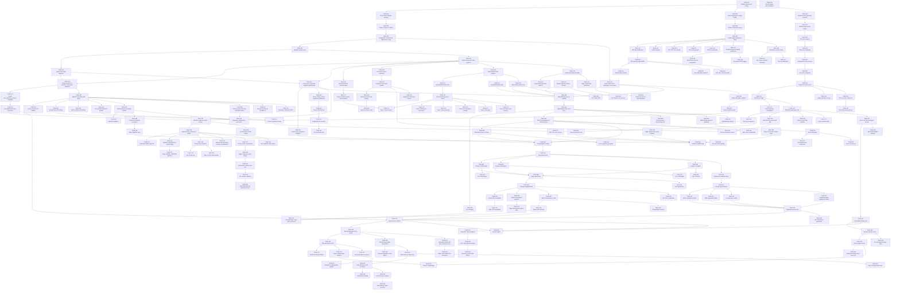

# GROWW CODE 2026 — Task Dependency Graph

```mermaid
flowchart TD
    %% ── EPIC 1: Project Foundation ──
    T001["TASK-001\nInitialize monorepo & tooling"]
    T002["TASK-002\nEnvironment variable strategy"]
    T003["TASK-003\nDocker Compose scaffold"]
    T004["TASK-004\nShared TypeScript config & linting"]

    %% ── EPIC 2: Backend Foundation ──
    T010["TASK-010\nInitialize Fastify API project"]
    T011["TASK-011\nFastify plugin architecture setup"]
    T012["TASK-012\nJWT auth middleware"]
    T013["TASK-013\nHealth endpoint"]
    T014["TASK-014\nRFC-7807 error handler"]
    T015["TASK-015\nRate limiting plugin"]
    T016["TASK-016\nCORS configuration"]
    T017["TASK-017\nRequest/response logging middleware"]

    %% ── EPIC 3: Database ──
    T020["TASK-020\nPostgreSQL connection & PgBouncer config"]
    T021["TASK-021\nMigration tooling setup"]
    T022["TASK-022\nCreate users table migration"]
    T023["TASK-023\nCreate instruments table migration"]
    T024["TASK-024\nCreate watchlists & watchlist_instruments migration"]
    T025["TASK-025\nCreate user_watchlist_sessions migration"]
    T026["TASK-026\nCreate price_snapshots migration (partitioned)"]
    T027["TASK-027\nCreate sector_snapshots migration"]
    T028["TASK-028\nCreate change_events migration (partitioned)"]
    T029["TASK-029\nCreate all DB indexes"]
    T030["TASK-030\nPostgreSQL RLS policies"]
    T031["TASK-031\nSeed instruments reference data"]

    %% ── EPIC 4: Redis Cache Layer ──
    T040["TASK-040\nRedis connection & namespace conventions"]
    T041["TASK-041\nRedis key schema documentation"]

    %% ── EPIC 5: Watchlist Management ──
    T050["TASK-050\nWatchlist repository (DB layer)"]
    T051["TASK-051\nCreate watchlist API handler"]
    T052["TASK-052\nList watchlists API handler"]
    T053["TASK-053\nDelete watchlist API handler"]
    T054["TASK-054\nGet watchlist detail API handler"]
    T055["TASK-055\nAdd instrument to watchlist handler"]
    T056["TASK-056\nRemove instrument from watchlist handler"]
    T057["TASK-057\nReorder instruments handler P2"]
    T058["TASK-058\nWatchlist validation"]
    T059["TASK-059\nDuplicate instrument prevention"]

    %% ── EPIC 6: Instrument Search ──
    T060["TASK-060\nInstrument search repository"]
    T061["TASK-061\nInstrument search API handler"]
    T062["TASK-062\nInstrument search rate limiting"]

    %% ── EPIC 7: Market Data Abstraction ──
    T070["TASK-070\nMarketDataProvider interface"]
    T071["TASK-071\nDemoMarketDataProvider"]
    T072["TASK-072\nLiveMarketDataProvider"]
    T073["TASK-073\nOutlier filter preprocessor"]
    T074["TASK-074\nMarket calendar & hours checker"]

    %% ── EPIC 8: Market Worker ──
    T080["TASK-080\nMarketWorker process scaffold"]
    T081["TASK-081\nMarketWorker 60s cycle loop"]
    T082["TASK-082\nCircuit breaker"]
    T083["TASK-083\nWrite PriceSnapshots to DB idempotent"]
    T084["TASK-084\nWrite latest prices to Redis"]
    T085["TASK-085\nFetch and store SectorSnapshots"]
    T086["TASK-086\nMarketWorker graceful shutdown"]

    %% ── EPIC 9: Change Engine ──
    T090["TASK-090\nChangeEngine scaffold"]
    T091["TASK-091\nSignal data model"]
    T092["TASK-092\nCompute VAPM signal"]
    T093["TASK-093\nCompute SRM signal"]
    T094["TASK-094\nCompute VA signal"]
    T095["TASK-095\nApply signal floors"]
    T096["TASK-096\nCompute weighted MCS"]
    T097["TASK-097\nHandle ATR unavailable"]
    T098["TASK-098\nHandle missing/stale snapshot"]
    T099["TASK-099\nWrite ChangeEvents to DB"]
    T100["TASK-100\nUpdate MCS in Redis"]
    T101["TASK-101\nChangeEngine reads cycle_id minus 1"]

    %% ── EPIC 10: Explanation Engine ──
    T110["TASK-110\nExplanation template library"]
    T111["TASK-111\nPrimary signal selector"]
    T112["TASK-112\nVAPM explanation builder"]
    T113["TASK-113\nSRM explanation builder"]
    T114["TASK-114\nVA explanation builder"]
    T115["TASK-115\nCombined-signal explanation builder"]
    T116["TASK-116\nExplanation guard rules"]

    %% ── EPIC 11: Last-Seen State ──
    T120["TASK-120\nUserWatchlistSession repository"]
    T121["TASK-121\nBaseline snapshot anchor lookup"]
    T122["TASK-122\nOptimistic last_checked_at update"]
    T123["TASK-123\nDwell-time update logic 30s"]
    T124["TASK-124\nNEVER_CHECKED first-visit handling"]
    T125["TASK-125\n30-day cap on baseline"]
    T126["TASK-126\nMarket-hours boundary baseline normalization"]
    T127["TASK-127\nCross-session reconciliation"]

    %% ── EPIC 12: Digest API ──
    T130["TASK-130\nDigestService scaffold"]
    T131["TASK-131\nBuild ranked digest from Redis"]
    T132["TASK-132\nFilter and rank by MCS"]
    T133["TASK-133\nAttach benchmark Nifty50"]
    T134["TASK-134\nDigest acknowledge endpoint"]
    T135["TASK-135\nData freshness label computation"]
    T136["TASK-136\nGraceful degradation stale digest"]
    T137["TASK-137\nNo-change digest response"]
    T138["TASK-138\nInstrument added after last_checked_at note"]

    %% ── EPIC 13: Data Freshness ──
    T140["TASK-140\nData freshness label rules"]
    T141["TASK-141\nStale detection in API envelope"]
    T142["TASK-142\nPartial data handling"]
    T143["TASK-143\nSuspended instrument label"]

    %% ── EPIC 14: Auth ──
    T150["TASK-150\nJWT issuance login RS256"]
    T151["TASK-151\nRefresh token rotation"]
    T152["TASK-152\nUser registration endpoint"]

    %% ── EPIC 15: Observability ──
    T160["TASK-160\nPrometheus metrics setup"]
    T161["TASK-161\napi_request_duration histogram"]
    T162["TASK-162\nMarketWorker metrics"]
    T163["TASK-163\nChangeEngine metrics"]
    T164["TASK-164\nprice_snapshot_age gauge"]
    T165["TASK-165\nOpenTelemetry trace propagation"]
    T166["TASK-166\nStructured JSON logging"]
    T167["TASK-167\nAlert rule definitions"]

    %% ── EPIC 16: Demo Mode ──
    T170["TASK-170\nDemo mode flag & env switch"]
    T171["TASK-171\nDemo: Normal market"]
    T172["TASK-172\nDemo: VAPM price movement"]
    T173["TASK-173\nDemo: Volume anomaly"]
    T174["TASK-174\nDemo: No meaningful change"]
    T175["TASK-175\nDemo: Stale data"]
    T176["TASK-176\nDemo: API failure and recovery"]
    T177["TASK-177\nDemo seeded accounts and watchlists"]

    %% ── EPIC 17: Frontend Foundation ──
    T200["TASK-200\nInitialize React TypeScript frontend"]
    T201["TASK-201\nGlobal design system tokens"]
    T202["TASK-202\nAPI client wrapper"]
    T203["TASK-203\nGlobal error boundary"]
    T204["TASK-204\nAuthentication flow screens"]
    T205["TASK-205\nApp router navigation"]
    T206["TASK-206\nResponsive layout shell"]

    %% ── EPIC 18: Watchlist UX ──
    T210["TASK-210\nWatchlist list page"]
    T211["TASK-211\nCreate watchlist modal"]
    T212["TASK-212\nDelete watchlist confirmation"]
    T213["TASK-213\nWatchlist detail page shell"]
    T214["TASK-214\nStock row component"]
    T215["TASK-215\nAdd stock flow search and add"]
    T216["TASK-216\nRemove stock from watchlist"]
    T217["TASK-217\nEmpty watchlist state"]

    %% ── EPIC 19: Digest UX ──
    T220["TASK-220\nSince Last Checked digest banner"]
    T221["TASK-221\nMeaningful change card"]
    T222["TASK-222\nAttention priority section"]
    T223["TASK-223\nDismiss digest action"]
    T224["TASK-224\nNo-meaningful-change state"]
    T225["TASK-225\nBenchmark Nifty50 indicator"]
    T226["TASK-226\nDwell-time dismiss timer front-end"]

    %% ── EPIC 20: Stock Detail ──
    T230["TASK-230\nStock detail page"]
    T231["TASK-231\n52w high/low bar component"]
    T232["TASK-232\nSector context row"]

    %% ── EPIC 21: Error / Loading / Empty / Stale ──
    T240["TASK-240\nLoading skeleton screens"]
    T241["TASK-241\nAPI error state component"]
    T242["TASK-242\nStale data warning banner"]
    T243["TASK-243\nData freshness indicator"]
    T244["TASK-244\nSuspended instrument label UI"]

    %% ── EPIC 22: Frontend Integration ──
    T250["TASK-250\nConnect watchlist list page"]
    T251["TASK-251\nConnect watchlist detail"]
    T252["TASK-252\nConnect digest"]
    T253["TASK-253\nConnect acknowledge"]
    T254["TASK-254\nConnect instrument search"]
    T255["TASK-255\n60s auto-refresh polling"]

    %% ── EPIC 23: Testing ──
    T300["TASK-300\nUnit: VAPM signal"]
    T301["TASK-301\nUnit: SRM signal"]
    T302["TASK-302\nUnit: VA signal"]
    T303["TASK-303\nUnit: MCS combination"]
    T304["TASK-304\nUnit: Signal floors"]
    T305["TASK-305\nUnit: Explanation generation"]
    T306["TASK-306\nUnit: Baseline anchor lookup"]
    T307["TASK-307\nUnit: Freshness label rules"]
    T308["TASK-308\nUnit: Outlier filter"]
    T309["TASK-309\nUnit: Market hours checker"]
    T310["TASK-310\nUnit: Optimistic SQL update"]
    T311["TASK-311\nUnit: 30-day cap"]
    T312["TASK-312\nIntegration: Watchlist CRUD"]
    T313["TASK-313\nIntegration: Add/remove instrument"]
    T314["TASK-314\nIntegration: Digest endpoint"]
    T315["TASK-315\nIntegration: Acknowledge updates"]
    T316["TASK-316\nIntegration: Instrument search"]
    T317["TASK-317\nE2E: Core user journey"]
    T318["TASK-318\nEdge: Duplicate stock"]
    T319["TASK-319\nEdge: Stock added after checkpoint"]
    T320["TASK-320\nEdge: ATR unavailable"]
    T321["TASK-321\nEdge: Missing/stale market data"]
    T322["TASK-322\nEdge: Zero volume/price"]
    T323["TASK-323\nEdge: Market-wide circuit breaker"]
    T324["TASK-324\nEdge: Concurrent multi-device"]
    T325["TASK-325\nEdge: Out-of-order market data"]
    T326["TASK-326\nEdge: Suspended instrument"]
    T327["TASK-327\nEdge: NEVER_CHECKED baseline"]
    T328["TASK-328\nEdge: 30-day stale baseline"]
    T329["TASK-329\nLoad: 100-instrument digest"]

    %% ── EPIC 24: Security ──
    T400["TASK-400\nInput sanitization audit"]
    T401["TASK-401\nJWT user_id enforcement"]
    T402["TASK-402\nRLS verification test"]
    T403["TASK-403\nRedis namespace isolation"]
    T404["TASK-404\nSecret rotation documentation"]

    %% ── EPIC 25: Final QA ──
    T500["TASK-500\nFull demo walkthrough"]
    T501["TASK-501\nCross-device multi-session test"]
    T502["TASK-502\nAPI contract validation"]
    T503["TASK-503\nPerformance p95 under 400ms"]
    T504["TASK-504\nData freshness label accuracy"]
    T505["TASK-505\nFinal README and deployment docs"]

    %% ═══════════ DEPENDENCY EDGES ═══════════

    T001 --> T002
    T001 --> T004
    T002 --> T003
    T004 --> T010

    T010 --> T011
    T011 --> T012
    T011 --> T013
    T011 --> T014
    T011 --> T015
    T011 --> T016
    T011 --> T017

    T003 --> T020
    T020 --> T021
    T021 --> T022
    T021 --> T023
    T022 --> T024
    T023 --> T024
    T024 --> T025
    T022 --> T026
    T023 --> T026
    T026 --> T027
    T026 --> T028
    T028 --> T029
    T029 --> T030
    T023 --> T031

    T020 --> T040
    T040 --> T041

    T012 --> T150
    T150 --> T151
    T150 --> T152

    T024 --> T050
    T050 --> T051
    T050 --> T052
    T050 --> T053
    T050 --> T054
    T050 --> T055
    T050 --> T056
    T050 --> T057
    T055 --> T058
    T055 --> T059

    T023 --> T060
    T060 --> T061
    T061 --> T062

    T023 --> T070
    T070 --> T071
    T070 --> T072
    T070 --> T073
    T074 --> T080

    T072 --> T080
    T073 --> T080
    T040 --> T080
    T026 --> T080
    T080 --> T081
    T081 --> T082
    T081 --> T083
    T083 --> T084
    T081 --> T085
    T081 --> T086

    T083 --> T090
    T084 --> T090
    T027 --> T090
    T090 --> T091
    T091 --> T092
    T091 --> T093
    T091 --> T094
    T092 --> T095
    T093 --> T095
    T094 --> T095
    T095 --> T096
    T096 --> T097
    T096 --> T098
    T096 --> T099
    T099 --> T100
    T082 --> T101
    T100 --> T101

    T091 --> T110
    T110 --> T111
    T111 --> T112
    T111 --> T113
    T111 --> T114
    T111 --> T115
    T112 --> T116
    T113 --> T116
    T114 --> T116
    T115 --> T116

    T025 --> T120
    T026 --> T121
    T120 --> T121
    T121 --> T122
    T122 --> T123
    T122 --> T124
    T122 --> T125
    T122 --> T126
    T122 --> T127

    T100 --> T130
    T120 --> T130
    T116 --> T130
    T130 --> T131
    T131 --> T132
    T132 --> T133
    T132 --> T134
    T131 --> T135
    T135 --> T136
    T132 --> T137
    T131 --> T138

    T135 --> T140
    T140 --> T141
    T141 --> T142
    T023 --> T143

    T011 --> T160
    T160 --> T161
    T081 --> T162
    T099 --> T163
    T084 --> T164
    T017 --> T165
    T017 --> T166
    T160 --> T167

    T071 --> T170
    T170 --> T171
    T170 --> T172
    T170 --> T173
    T170 --> T174
    T170 --> T175
    T170 --> T176
    T031 --> T177
    T177 --> T171

    T001 --> T200
    T200 --> T201
    T201 --> T202
    T202 --> T203
    T203 --> T204
    T204 --> T205
    T205 --> T206

    T206 --> T210
    T210 --> T211
    T210 --> T212
    T210 --> T213
    T213 --> T214
    T213 --> T215
    T213 --> T216
    T213 --> T217

    T213 --> T220
    T220 --> T221
    T221 --> T222
    T222 --> T223
    T222 --> T224
    T220 --> T225
    T223 --> T226

    T214 --> T230
    T230 --> T231
    T230 --> T232

    T206 --> T240
    T206 --> T241
    T241 --> T242
    T141 --> T243
    T143 --> T244

    T054 --> T250
    T052 --> T250
    T250 --> T251
    T130 --> T252
    T134 --> T253
    T061 --> T254
    T251 --> T255

    T211 --> T250
    T214 --> T251
    T221 --> T252
    T223 --> T253
    T215 --> T254

    T092 --> T300
    T093 --> T301
    T094 --> T302
    T096 --> T303
    T095 --> T304
    T116 --> T305
    T121 --> T306
    T140 --> T307
    T073 --> T308
    T074 --> T309
    T122 --> T310
    T125 --> T311
    T050 --> T312
    T055 --> T313
    T056 --> T313
    T130 --> T314
    T134 --> T315
    T061 --> T316
    T059 --> T318
    T138 --> T319
    T097 --> T320
    T098 --> T321
    T083 --> T322
    T127 --> T324
    T083 --> T325
    T143 --> T326
    T124 --> T327
    T125 --> T328
    T314 --> T329

    T150 --> T401
    T030 --> T402
    T040 --> T403
    T062 --> T400

    T317 --> T500
    T318 --> T500
    T323 --> T500
    T325 --> T500
    T501 --> T502
    T329 --> T503
    T243 --> T504
    T502 --> T505
    T324 --> T501
```
